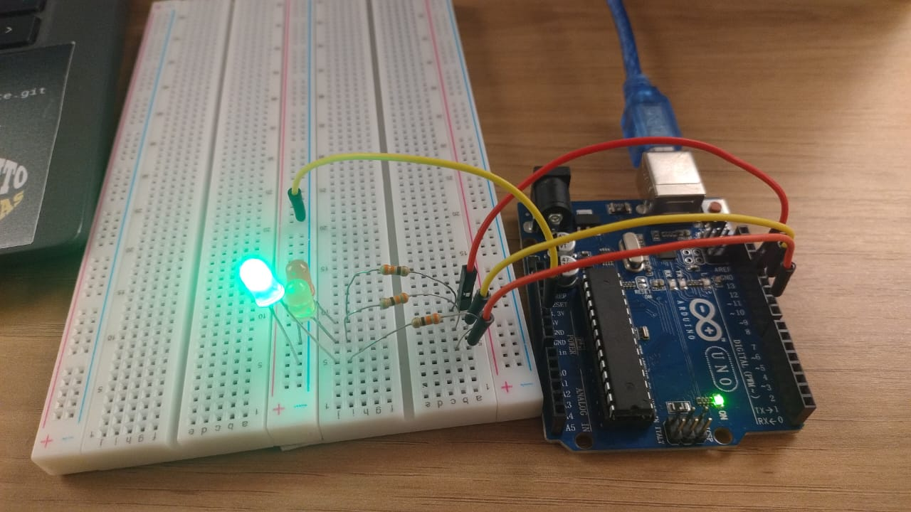
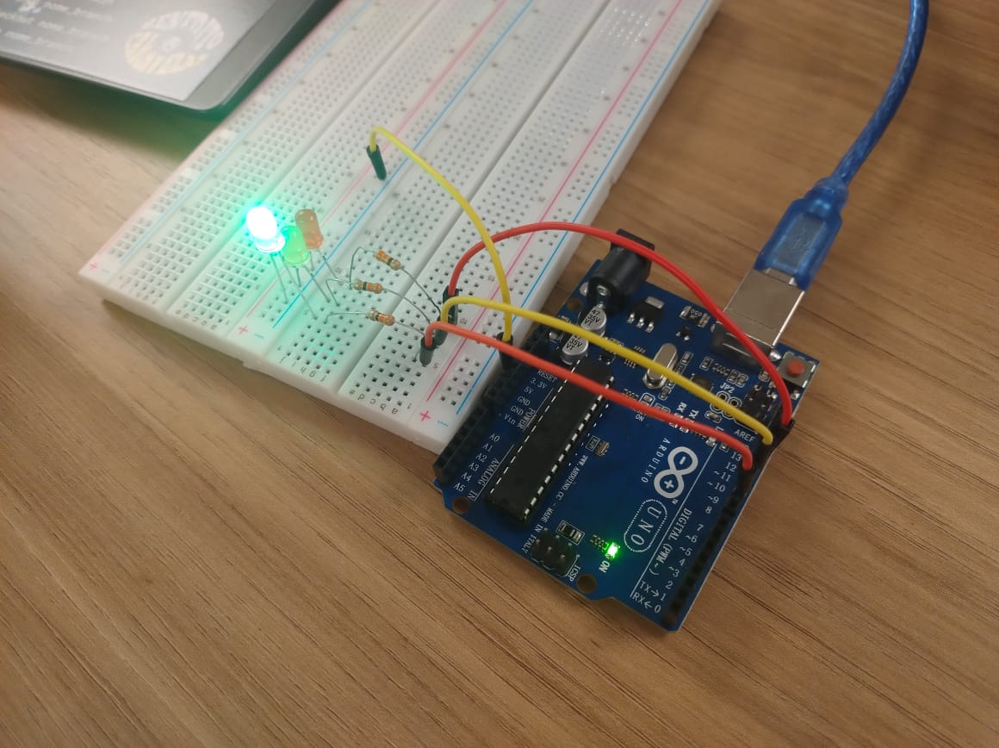

**Aluna:** Karine Victoria Rosa da Paixão 

**Data:** 29/10/2024 

**Turma 14 - Grupo 1**

&nbsp;&nbsp;&nbsp;&nbsp;A atividade proposta foi a criação de um sistema de semáforo offline com temporização específica, sem qualquer interação com sensores ou redes, que simule uma situação real de controle de tráfego. O semáforo segue a estrutura cronológica abaixo, com tempos definidos para cada cor e um tempo adicional para acomodar uma travessia segura de pedestres.

- 6 segundos no vermelho
- 2 segundos no amarelo
- 2 segundos no verde
- +2 segundos no verde (simulando um tempo adicional para pedestres terminarem a travessia)
- 2 segundos no amarelo

&nbsp;&nbsp;&nbsp;&nbsp;A montagem do sistema foi realizada com componentes físicos fundamentais para seu funcionamento. Esses componentes estão detalhados no quadro 1, logo abaixo, que apresenta cada item utilizado na estrutura do sistema, descrevendo suas funções e como contribuem para o processo de simulação do semáforo.

Quadro 1 - Componentes ultilizados

| Componentes      | Quantidade | Função 
|------------------|------------|------------|
| Protoboard       | 1          |Base para conexão dos componentes eletrônicos sem necessidade de soldagem |
| Led verde        | 1          |Indica a luz verde do semáforo, sinalizando permissão de passagem |
| Led vermelho     | 1          | Indica a luz vermelha do semáforo, sinalizando parada|
| Led amarelo      | 1          | Indica a luz amarela do semáforo, sinalizando alerta de mudança de estado.|
|   Arduino        | 1          | Microcontrolador responsável pelo controle e temporização das fases do semáforo.|
|  Jumpers         | 4          | Cabos que conectam os componentes na protoboard e no Arduino.|
|Resistores de 330 ohms| 1          | Limita a corrente para proteger os LEDs de danos causados por excesso de corrente. |

Fonte: Material produzido pela autora (2024)

&nbsp;&nbsp;&nbsp;&nbsp;Esses componentes foram utilizados na montagem do semáforo, garantindo o funcionamento adequado do circuito e a simulação precisa dos sinais de trânsito. Cada item desempenha um papel importante, permitindo a troca de fases. As Figuras 1 e 2, apresentadas abaixo, ilustram a disposição física dos componentes. Elas mostram como eles se conectam para gerar um sistema de controle de tráfego em miniatura.

&nbsp;&nbsp;&nbsp;&nbsp;Para complementar a visualização, também foi feito um vídeo que pode ser encontrado [aqui](https://youtu.be/ClRAKrsz8bA), proporcionando uma demonstração prática do funcionamento do semáforo.

Figura 1 - Imagem do semáforo

Fonte: Material produzido pela autora (2024)

Figura 2 - Imagem do semáforo

Fonte: Material produzido pela autora (2024)

&nbsp;&nbsp;&nbsp;&nbsp;Para além disso, abaixo estão localizadas as avaliações dos avaliadores em relação ao prototipo: as duas notas finais foram 10, formando a nota final como 10. As avalições pode ser vistas no quadro 2 e 3

### Avaliador: Lucas Ramenzoni

Quadro 2 - Avaliação

Critério                                                                                                 | Contempla (Pontos) | Contempla Parcialmente (Pontos) | Não Contempla (Pontos) | Observações do Avaliador |
|---------------------------------------------------------------------------------------------------------|--------------------|----------------------------------|--------------------------|---------------------------|
| Montagem física com cores corretas, boa disposição dos fios e uso adequado de resistores                | Até 3              | Até 1,5                            | 0                        |           3, os fios estão bem organizados               |
| Temporização adequada conforme tempos medidos com auxílio de algum instrumento externo                  | Até 3              | Até 1,5                          | 0                        |            3, o tempo estava correto               |
| Código implementa corretamente as fases do semáforo e estrutura do código (variáveis representativas e comentários) | Até 3              | Até 1,5                          | 0                        |             3, codigo claro e simples de entender             |
| Extra: Implmeentou um componente de liga/desliga no semáforo e/ou usou ponteiros no código | Até 1              |  Até 0,5                         | 0                        |           1, pois ultilizou funções em seu codigo                |
|  |                                                             |  | |**Pontuação Total: 10**|

Fonte: Material produzido pela autora (2024)

### Avaliador: Gustavo Colombini

Quadro 2 - Avaliação

| Critério                                                                                                 | Contempla (Pontos) | Contempla Parcialmente (Pontos) | Não Contempla (Pontos) | Observações do Avaliador |
|---------------------------------------------------------------------------------------------------------|--------------------|----------------------------------|--------------------------|---------------------------|
| Montagem física com cores corretas, boa disposição dos fios e uso adequado de resistores                | Até 3              | Até 1,5                            | 0                        |            3               |
| Temporização adequada conforme tempos medidos com auxílio de algum instrumento externo                  | Até 3              | Até 1,5                          | 0                        |             3              |
| Código implementa corretamente as fases do semáforo e estrutura do código (variáveis representativas e comentários) | Até 3              | Até 1,5                          | 0                        |             3              |
| Extra: Implmeentou um componente de liga/desliga no semáforo e/ou usou ponteiros no código | Até 1              |  Até 0,5                         | 0                        |              1, pois usou funções para trocas de fases.             |
|  |                                                             |  | |**Pontuação Total: 10**|

Fonte: Material produzido pela autora (2024)

